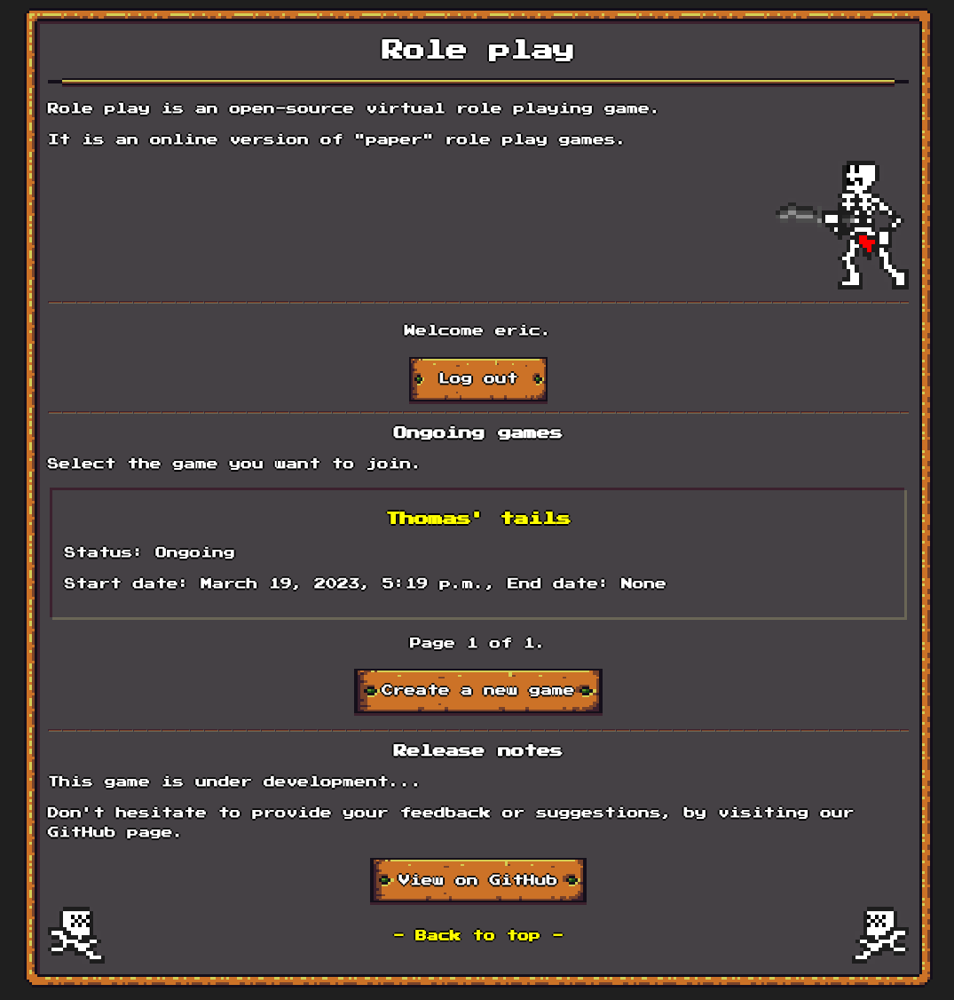
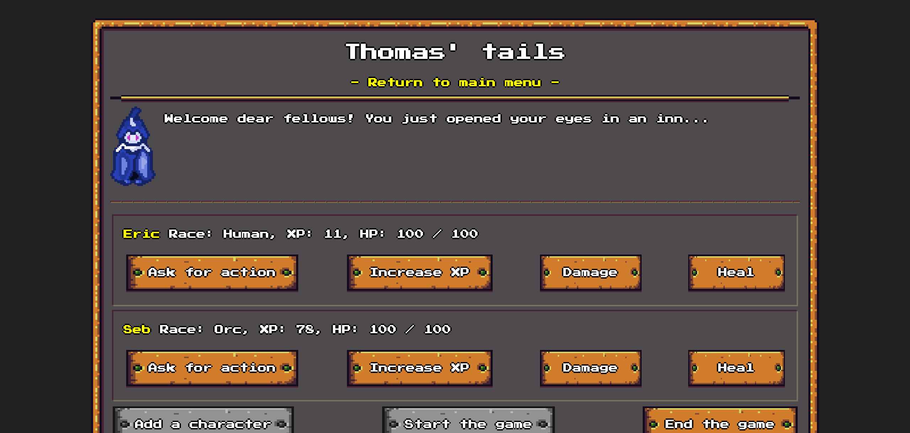
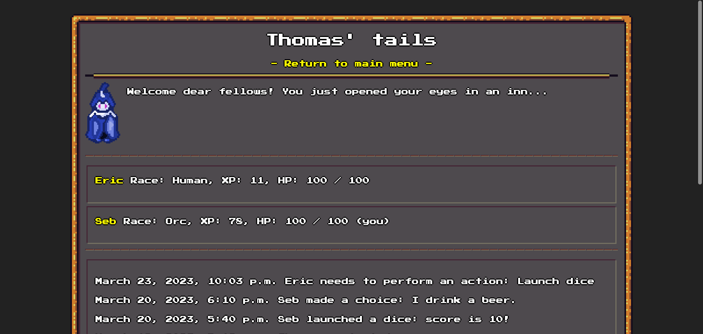

# role-play
Role playing game.

## Purpose
Instead of playing role play with paper, you can do it online!

`role-play` is a virtual role playing game. It allows people to play remotely, by following a tail and performing some actions like throwing dices or making choices.

> **Warning**
> This project is under development.

## Screenshots

> **Warning**
> The screenshots below might not be accurate: the UI is changing a lot, as the project is under development.

### Main page

### Example of game
Master view.

Player view.

## Requirements
`role-play` has been developed and tested with Python 3.11.
